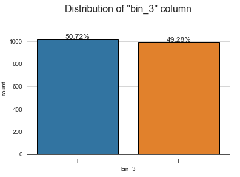
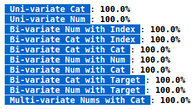
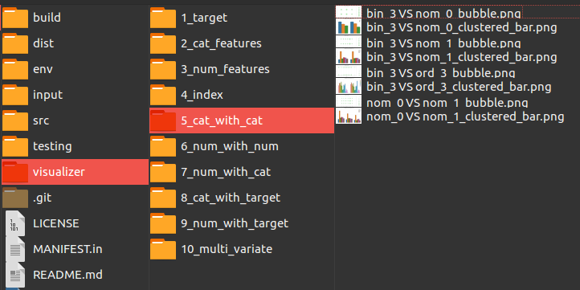

# Visualizer:
**Visualizer** is a Python package that automates the process of visualization and facilitates the plotting of any individual relationship between multiple-columns.

**Visualizer** package allows you to do 2 types of plotting:

1. Visualize by an **individual column**:
    - Count Plot.
    - Pie Plot.
    - Histogram plot.
    - KDE plot.
    - WordCloud plot.
    - Histogram for high cardinality columns.
    - Line plot with index.
    - Point plot with index.
    - Clustered-bar Plot.
    - Bubble plot.
    - Scatter plot.
    - Density plot.
    - Box plot.
    - Violin plot.
    - Ridge plot.
    - Parallel plot.
    - Radar plot.


2. Visualize by a **relationship** (multiple-columns):
     - Uni-vairate Target.
     - Uni-variate Categorical (Cat).
     - Uni-variate Numerical (Num).
     - Bi-variate Num with Index.
     - Bi-variate Cat with Index.
     - Bi-variate Num with Num.
     - Bi-variate Num with Cat.
     - Bi-variate Cat with Cat.
     - Bi-variate Cat with Target.
     - Bi-variate Num with Target.
     - Multi-variate Nums with Cat.


## Installation:
```python
pip install -U visualizer
```

## Usage:

1. To use the first type **Individual Plotting**, all the methods starts with **create_**, and you can use them as follows:
```python
# Import the library
from visualizer import Visualize

# Create a count plot
Visualizer.create_count_plot(df=df, cat_col="bin_3", annot=True)
```



To see more types of individual plotting, you can see the [docs](https://mosaabmuhammed.github.io/visualizer/testing/Docs.html).

1. To use the second type **Automatic Visualization**, all the methods starts with **visualize_**, and you can them as follows:
```python
# Import the library
from visualizer import Visualizer

autoVis = Visualizer(df=df,                    # df: (dataframe)
                    num_cols=num_cols,         # num_cols: (list) of numerical columns.
                    cat_cols=cat_cols,         # cat_cols: (list) of categorical columns.
                    target_col=target_col,     # target_col: (string) your target column.
                    ignore_cols=ignore_cols,   # ignore_cols: (list) of columns to ignore.
                    problem_type='classification') # problem_type: (string) ['classification', 'regression']

# Visualize all the relationships between the selected columns,
# whether it's uni-variate, Bi-variate, or even multi-variate.
# This methods saves the generated figures into folder named "visualizer"
# into the current directory.
autoVis.visualize_all()
```


After running this command, the output in your notebook will tell you the progress, and when it's finished, it will be like this:



And your current directory will have a new folder called "visualizer", which contains all the relationships between the columns.

So you can go to each particular relationship "folder", and see the related figures, does it contain any pattern?



To know more, you can see the [docs](https://mosaabmuhammed.github.io/visualizer/testing/Docs.html).


## Further Ideas/Developments:

The following ideas are under construction and it will be added soon in upcoming versions:

1. Visualize **Sparse** Columns, to see if they have a pattern.

2. Visualize **NaN/Infinite/Large numeric** values across the whole dataframe, to see the pattern of the whole dataframe.
3. Visualize **Text** columns.
4. Add the functionality to arrange the structure of the folders to be by **columns**, so each column has all the relationships for a specific column.


## Contribute:
If you've found a bug or something that you would like to improve, don't hesitate to create an issue and create a pull request.

## License:
MIT License.

## Authors:
- [Mosaab Muhammad](https://www.linkedin.com/in/mosaabmuhammed/)


